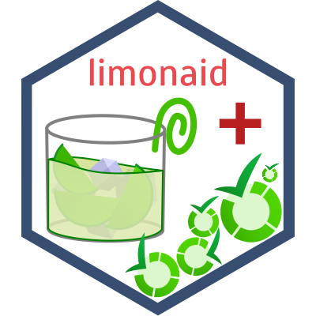

```{r setup, include=FALSE}

knitr::opts_chunk$set(
  collapse = TRUE,
  comment = "#>",
  fig.path = "man/figures/README-",
  out.width = "100%"
)

packagename <- 'limonaid';
packageSubtitle <- 'Working With LimeSurvey Surveys and Responses';

gitLab_ci_badge <-
  paste0("https://gitlab.com/r-packages/", packagename, "/badges/prod/pipeline.svg");
gitLab_ci_url <-
  paste0("https://gitlab.com/r-packages/", packagename, "/-/commits/prod");

codecov_badge <-
  paste0("https://app.codecov.io/gl/r-packages/", packagename, "/branch/prod/graph/badge.svg");
codecov_url <-
  paste0("https://codecov.io/gl/r-packages/", packagename, "?branch=prod");

pkgdown_url <-
  paste0("https://r-packages.gitlab.io/", packagename);

cran_url <-
  paste0("https://cran.r-project.org/package=", packagename);
cranVersion_badge <-
  paste0("https://www.r-pkg.org/badges/version/", packagename, "?color=brightgreen");
cranLastMonth_badge <-
  paste0("https://cranlogs.r-pkg.org/badges/last-month/", packagename, "?color=brightgreen");
cranTotal_badge <-
  paste0("https://cranlogs.r-pkg.org/badges/grand-total/", packagename, "?color=brightgreen");

```

<!-- badges: start -->[](`r gitLab_ci_url`)
[](`r codecov_url`)
[](`r cran_url`)
[](`r cran_url`)
[](`r cran_url`)
<!-- badges: end -->

#  `r paste(packagename, "\U1F4E6")`

`r packagename`: `r packageSubtitle`

The pkgdown website for this project is located at `r pkgdown_url`.

<!--------------------------------------------->
<!-- Start of a custom bit for every package -->
<!--------------------------------------------->

LimeSurvey is Free/Libre Open Source Software for
the development and administrations of online studies, using
sophisticated tailoring capabilities to support multiple study
designs. This package supports programmatic creation of surveys
that can then be imported into LimeSurvey, as well as
userfriendly import of responses from LimeSurvey studies.

<!--------------------------------------------->
<!--  End of a custom bit for every package  -->
<!--------------------------------------------->

## Installation

You can install the released version of ``r packagename`` from [CRAN](https://CRAN.R-project.org) with:

```{r echo=FALSE, comment="", results="asis"}
cat(paste0("``` r
install.packages('", packagename, "');
```"));
```

You can install the development version of ``r packagename`` from [GitLab](https://about.gitlab.com) with:

```{r echo=FALSE, comment="", results="asis"}
cat(paste0("``` r
remotes::install_gitlab('r-packages/", packagename, "');
```"));
```

(assuming you have `remotes` installed; otherwise, install that first using the `install.packages` function)
